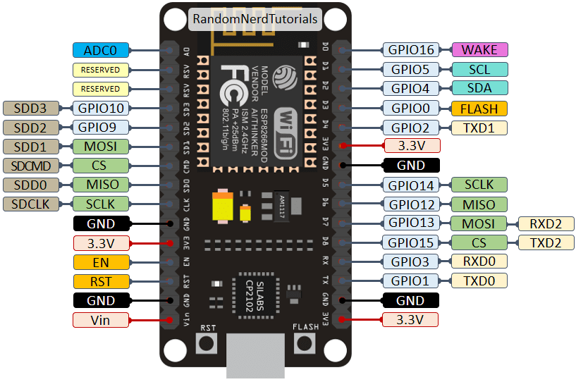

# Micropython Thermostate implementation

## Prerequisites

### Hardware

* **nodemcu esp8266**



### Software

Is necessary to install the next apps via apt install:

  * picocom

And the next python packages:
  * esptool
  * adafruit-ampy

## Install dependencies

To install all dependencies you can to run the next script:

```
  $ ./scripts/provision.sh
```

This script will create a virtualenv in .venv/thermostate-device, will install
all pip dependencies inside and next will install picocom

## IO interface

To read/write in the microcontroller you have to know what is the port of this
device.

To know the port of your device you can to list the files in /dev/

Usually the port are **/dev/ttyUSB0** but can be **/dev/ttyUSB\<any number\>**

 > If you have a port diferent to **/dev/ttyUSB0**, you have to set your port in
.env file.

In order to read/write in this port without sudo is necessary to add your user
in dialout group with the next command:

```
  $ sudo usermod -a -G dialout $USER
```

## Install/Update firmware

To install new firmware in ESP2866 microcontroller run script firmware.sh:

```
  $ ./scripts/firmware.sh
```

This script will remove the firmware in the microcontroller and install the
firmware stored in ./firmware directory

## Work with files (ampy)

To work with files in the microcontroller will use ampy.

  * list files: ampy --port \<port\> --baud \<baud\> ls
  * remove file: ampy --port \<port\> --baud \<baud\> rm file
  * download file: ampy --port \<port\> --baud \<baud\> get file ./local/file
  * upload file: ampy --port \<port\> --baud \<baud\> put ./local/file file

\<port\> is the port where you device is connected (Usually /dev/ttyUSB0)

\<baud\> Is the speed in baud to transmit/receive (Usually and max 115200)

Example to list the files in the device:

```
  $ ampy --port /dev/ttyUSB0 --baud 115200 ls
```

To get more documentation visit:
[ampy file operations](https://learn.adafruit.com/micropython-basics-load-files-and-run-code/file-operations)

## Project structure

The src dir contain all files that will be upload to device.
Files outside of this folder not will be uploaded.

Inside folder src exists the folder config. Inside the config dir you have to
create a file called config.py with the wifi credentials. You can found a
example in src/config/config_example.py

## Flash code

To flash the code in the device run the next command:

```
  $ ./scripts/flash.sh
```

This command remove all files in the device and upload all files in the src
folder

## Run code and debug

To run the code and views the traces you can to execute:

```
  $ ./scripts/run.sh
```

This command upload src files calling flash.sh script and run main.py